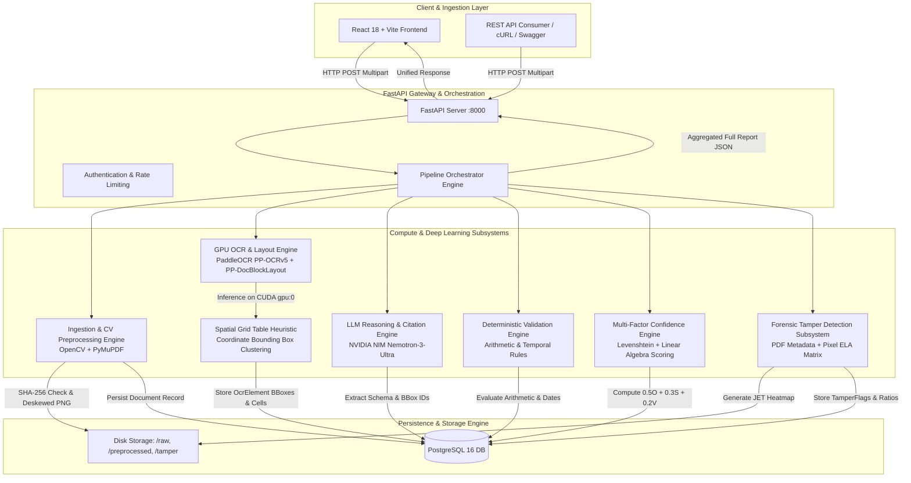
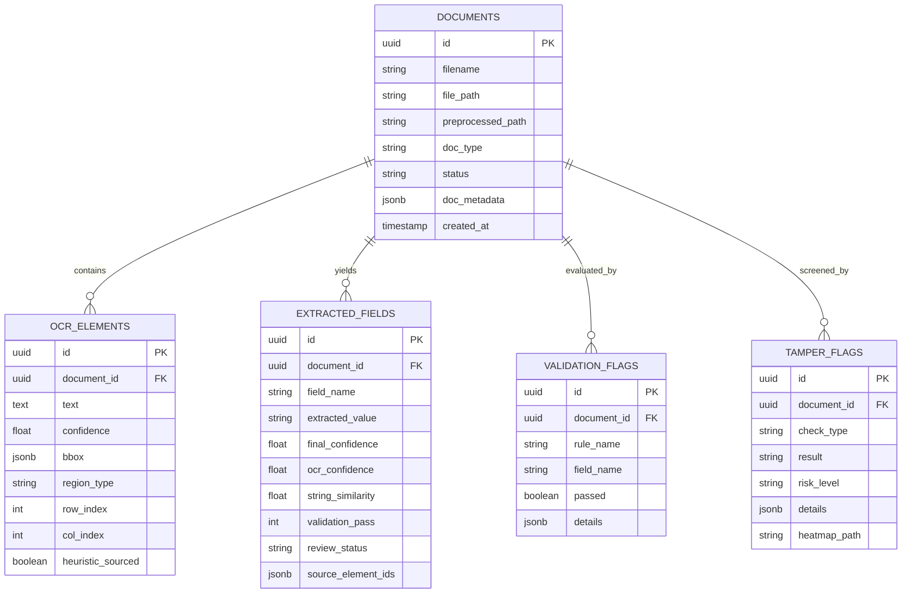

# 📄 Comprehensive Technical & Architectural Blueprint

This document details the complete **underlying technology stack, algorithmic pipelines, data flow state transitions, and architectural diagrams** powering the Document Intelligence & Forensic Tamper Detection platform.

---

## 🏛️ High-Level System Architecture

The platform follows an asynchronous, decoupled, API-first microservices architecture built for high-throughput document ingestion, GPU-accelerated deep learning inference, LLM-based structured reasoning, deterministic mathematical auditing, and pixel-level forensic analysis.



---

## 🔄 End-to-End Pipeline Dataflow & State Machine

Every document uploaded progresses through a deterministic, strictly validated finite state machine (FSM):

```
       [ Client Upload ]
               │
               ▼
       ┌───────────────┐
       │   UPLOADED    │ ──► Compute SHA-256 Hash (Reject/Flag Duplicates)
       └───────┬───────┘
               │  OpenCV Deskewing & Bilateral Filter
               ▼
       ┌───────────────┐
       │ PREPROCESSED  │ ──► Normalized 300 DPI Clean Image
       └───────┬───────┘
               │  PaddleOCR GPU Inference (PP-OCRv5 Server Det & Rec)
               ▼
       ┌───────────────┐
       │   OCR_DONE    │ ──► Confidence Gate (c < 0.30 ➔ UNPROCESSABLE)
       └───────┬───────┘     Spatial Grid Coordinate Clustering
               │
               ▼  NVIDIA NIM Nemotron-3-Ultra Schema Extraction
       ┌───────────────┐
       │ LLM_EXTRACTED │ ──► Mandatory Citation (source_element_ids)
       └───────┬───────┘
               │
               ▼  Floating-Point Math & Temporal Rules
       ┌───────────────┐
       │   VALIDATED   │ ──► subtotal + tax == total (Log Delta Mismatch)
       └───────┬───────┘
               │
               ▼  Multi-Factor Vector Scoring (0.5*O + 0.3*S + 0.2*V)
       ┌──────────────────┐
       │ CONFIDENCE_SCORED│ ──► Hard Clamping (V = 0 ➔ Confidence <= 0.50)
       └───────┬──────────┘
               │
               ▼  PDF Metadata Check + Error Level Analysis (JPEG Q=90)
       ┌────────────────┐
       │ TAMPER_CHECKED │ ──► 64x64 Grid Variance Ratio & Color Heatmap
       └───────┬────────┘
               │
     ┌─────────┴─────────┐
     │  Routing Decision │
     └─────────┬─────────┘
               │
      ┌────────┴────────┐
      ▼                 ▼
┌───────────────┐ ┌───────────────┐
│ AUTO_ACCEPTED │ │ NEEDS_REVIEW  │
│ (Score >=0.70 │ │ (Score <0.70  │
│ & Math Pass   │ │ OR Math Fail  │
│ & Clean ELA)  │ │ OR ELA High)  │
└───────────────┘ └───────────────┘
```

---

## 🧩 Deep Technical Breakdown: The 7 Subsystems

---

### Station 1: Ingestion, Deduplication & Computer Vision Preprocessing

#### 1. Technical Purpose
Normalizes arbitrary inputs (PDF, PNG, JPG, WebP) into an aligned, deskewed, high-contrast, artifact-free image matrix ready for neural character recognition while eliminating redundant compute through cryptographic hashing.

```
Raw File ──► [SHA-256 Hash] ──► Query Postgres doc_metadata
                 │
                 ├──► [If PDF] ──► PyMuPDF fitz (300 DPI Rendering)
                 │
                 └──► [OpenCV Deskew] ──► Otsu Threshold ──► minAreaRect ──► Affine Warp
                                              │
                                              ▼
                                    Bilateral Filter ──► Normalized Clean PNG
```

#### 2. Underlying Algorithms & Technologies
* **Cryptographic Byte Hashing:**
  $$\text{Digest} = \text{SHA256}(\text{FileBytes})$$
  Executed in $\mathcal{O}(N)$ stream time before disk persistence. Fast lookup on indexed `doc_metadata->>'sha256'`.
* **PDF Rasterization (`PyMuPDF / fitz`):**
  Renders vector documents to high-resolution bitmaps using a target zoom factor:
  $$\text{Matrix}(\text{scale}_x=4.166, \text{scale}_y=4.166) \implies 300\text{ DPI}$$
* **Geometric Deskewing (`OpenCV`):**
  1. Grayscale conversion $\rightarrow$ Otsu Binarization (`cv2.threshold` with `THRESH_BINARY_INV + THRESH_OTSU`).
  2. Bounding contour extraction: `cv2.findNonZero()` isolates text pixels.
  3. Minimum area oriented bounding box: `cv2.minAreaRect()` returns center point, dimensions, and angle $\theta \in [-90^\circ, 0^\circ)$.
  4. Angle normalization:
     $$\theta_{\text{corrected}} = \begin{cases} -(90 + \theta) & \text{if } \theta < -45^\circ \\ -\theta & \text{if } \theta \ge -45^\circ \end{cases}$$
  5. Affine transformation via `cv2.getRotationMatrix2D(center, \theta_{\text{corrected}}, 1.0)` and `cv2.warpAffine()`.
* **Edge-Preserving Denoising (`cv2.bilateralFilter`):**
  $$I^{\text{filtered}}(x) = \frac{1}{W_p} \sum_{x_i \in \Omega} I(x_i) f_r(\|I(x_i) - I(x)\|) g_s(\|x_i - x\|)$$
  Parameters: `d=9, sigmaColor=75, sigmaSpace=75`. Smooths scanner background noise while preserving sharp font glyph edges.

---

### Station 2: GPU-Accelerated OCR & Spatial Table Layout Heuristic

#### 1. Technical Purpose
Localizes all textual bounding boxes on the document canvas, predicts character transcriptions with associated confidence probabilities on GPU, and reconstructs 2D tabular grids when native segmentation models encounter ambiguous borders.

```
Deskewed Image ──► [PaddleX / CUDA gpu:0]
                         │
                         ├──► PP-DocBlockLayout (Region Classification)
                         ├──► PP-LCNet Orientation (Upright Rotation)
                         ├──► PP-OCRv5 Server Det (DBNet Text Contours)
                         └──► PP-OCRv5 Server Rec (SVTR Character Sequence)
                                       │
                                       ▼
                         BBoxes & Confidences [x, y, w, h, conf]
                                       │
                         [Confidence Gate: conf >= 0.30]
                                 /            \
                           VALID (OK)     UNPROCESSABLE (Shielded from LLM)
                                 │
                         [Spatial Grid Clustering Heuristic]
                                 │
                         Reconstructed 2D Table Matrix (row_idx, col_idx)
```

#### 2. Underlying Models & Architecture
* **Hardware Acceleration:** Native PyTorch / PaddlePaddle C++ runtime running on CUDA 12.3 (`device="gpu:0"`).
* **Text Detection (`PP-OCRv5_server_det`):**
  Based on Differentiable Binarization (DBNet) architecture with a lightweight convolutional backbone, producing precise polygon hulls and bounding rectangles $[x, y, w, h]$.
* **Text Recognition (`PP-OCRv5_server_rec`):**
  Combines vision transformer (SVTR) and CTC sequence decoding to output Unicode string sequences and per-box confidence $c_i \in [0.0, 1.0]$.
* **Quality Gate Filter:**
  $$\text{Status}(e_i) = \begin{cases} \text{"OK"} & \text{if } c_i \ge 0.30 \\ \text{"UNPROCESSABLE"} & \text{if } c_i < 0.30 \end{cases}$$
  Shields the downstream LLM from low-confidence optical artifacts.
* **Spatial Grid Clustering Algorithm (`infer_table_grid`):**
  When table border lines are faded or absent:
  1. Horizontal band clustering: Sorts elements by $y$-coordinate. Bins elements into rows where $|y_i - y_j| \le \frac{\text{median\_height}}{2}$.
  2. Vertical column alignment: Within each row, sorts elements by $x$-coordinate and calculates dynamic column dividers.
  3. Tags structured cells with `heuristic_sourced = true` in PostgreSQL for provenance auditing.

---

### Station 3: LLM Schema Extraction & Mandatory Citation Graph

#### 1. Technical Purpose
Transforms unstructured OCR token streams into strongly-typed, normalized JSON entities according to locked domain schemas (Invoices and Salary Slips), eliminating generative hallucinations through mathematical citation constraints.

```
OCR Elements (Status: OK) ──► Prompt Serializer (Formats ID + BBox + Text)
                                       │
                                       ▼
                       [NVIDIA NIM: Nemotron-3-Ultra]
                       (System Prompt Enforcing Strict Schemas)
                                       │
                                       ├── Entity Normalization (Dates to ISO 8601, Currencies to Float)
                                       ├── Synonym Resolution ("Vendor" ➔ "seller")
                                       └── Mandatory Citation Enforcement:
                                           field.value != null ⟹ len(source_element_ids) >= 1
                                           field.value == null ⟹ len(source_element_ids) == 0
                                       │
                                       ▼
                       Structured ExtractedField Records in PostgreSQL
```

#### 2. Models & Extraction Contracts
* **Inference Endpoint:** NVIDIA NIM API (`https://integrate.api.nvidia.com/v1`).
* **Model:** `nvidia/nemotron-3-ultra-550b-a55b` executed with `temperature=0.1` and `chat_template_kwargs={"enable_thinking": False}` to prioritize deterministic extraction over free-form chain-of-thought generation.
* **Strict Pydantic Contracts:**
  - `InvoiceSchema`: `seller`, `buyer`, `invoice_no`, `invoice_date`, `due_date`, `subtotal`, `tax`, `total`, `line_items`.
  - `SalarySlipSchema`: `employee_name`, `employer`, `pay_period`, `gross`, `deductions`, `net_pay`.
* **Zero-Hallucination Invariant:**
  $$\forall f \in \text{Fields}: \quad \text{Value}(f) \neq \text{null} \implies |\text{Citations}(f)| \ge 1 \quad \wedge \quad \text{Citations}(f) \subseteq \text{ValidOcrIDs}$$
  If an entity does not exist in the source document, the model is strictly bound to return `null` and record the missing key in `could_not_extract`.

---

### Station 4: Deterministic Mathematical Validation Engine

#### 1. Technical Purpose
Decouples numerical reasoning from generative models by executing floating-point arithmetic audits and date ordering checks in pure Python to catch misread digits, OCR dropouts, or forged amounts.

```
Extracted Fields ──► [Floating-Point Conversion]
                             │
                             ├── Audit 1: |subtotal + tax - total| <= 0.05
                             ├── Audit 2: |gross - deductions - net_pay| <= 0.05
                             └── Audit 3: parse_date(due_date) >= parse_date(invoice_date)
                             │
                             ▼
              Persist ValidationFlag Records:
              - rule_name: "subtotal_tax_sum"
              - passed: False
              - details: { subtotal: 81500, tax: 1500, total: 815000, difference: 732000 }
```

#### 2. Mathematical Rule Specifications
* **Invoice Accounting Rule:**
  $$\Delta_{\text{inv}} = |\text{Subtotal} + \text{Tax} - \text{Total}|$$
  $$\text{Pass}_{\text{inv}} = \begin{cases} 1.0 & \text{if } \Delta_{\text{inv}} \le 0.05 \\ 0.0 & \text{if } \Delta_{\text{inv}} > 0.05 \end{cases}$$
* **Payroll Accounting Rule:**
  $$\Delta_{\text{sal}} = |\text{Gross} - \text{Deductions} - \text{NetPay}|$$
  $$\text{Pass}_{\text{sal}} = \begin{cases} 1.0 & \text{if } \Delta_{\text{sal}} \le 0.05 \\ 0.0 & \text{if } \Delta_{\text{sal}} > 0.05 \end{cases}$$
* **Temporal Sequence Rule:**
  $$\text{Pass}_{\text{date}} = \begin{cases} 1.0 & \text{if } \mathcal{T}(\text{due\_date}) \ge \mathcal{T}(\text{invoice\_date}) \\ 0.0 & \text{otherwise} \end{cases}$$

---

### Station 5: Multi-Factor Linear Confidence Engine

#### 1. Technical Purpose
Computes a mathematically grounded, verifiable confidence score for every extracted field by combining optical clarity, lexical similarity, and mathematical correctness—preventing generative models from self-scoring.

```
Cited OCR Elements ──► [Mean Optical Confidence O]
                                │
Raw OCR String vs Value ──► [Levenshtein String Similarity S]
                                │
ValidationFlag Result ──► [Deterministic Verification V]
                                │
                                ▼
         Linear Weighted Combination: Score = 0.5*O + 0.3*S + 0.2*V
                                │
                 Is Validation Pass V == 0?
                        /               \
                      YES               NO
                      /                   \
        Clamp Score: min(Score, 0.50)   Unclamped Score
                      \                   /
                       ▼                 ▼
          Final Confidence & Routing (>=0.70 ➔ auto_accepted, <0.70 ➔ needs_review)
```

#### 2. Mathematical Formulas & Vector Components
For each field $f$:
$$\text{Confidence}(f) = w_o \cdot O(f) + w_s \cdot S(f) + w_v \cdot V(f)$$
Where weights are locked to:
$$w_o = 0.50, \quad w_s = 0.30, \quad w_v = 0.20 \quad \left(\sum w_i = 1.0\right)$$

* **Component $O(f)$ (Optical Clarity):**
  $$O(f) = \frac{1}{|C(f)|} \sum_{i \in C(f)} \text{conf}(e_i)$$
  Where $C(f)$ is the set of cited OCR bounding boxes for field $f$.
* **Component $S(f)$ (Lexical Similarity):**
  Based on normalized Levenshtein edit distance:
  $$S(f) = 1.0 - \frac{\text{LevenshteinDistance}(\text{val}_{\text{norm}}, \text{ocr}_{\text{norm}})}{\max(\text{len}(\text{val}_{\text{norm}}), \text{len}(\text{ocr}_{\text{norm}}))}$$
* **Component $V(f)$ (Validation Pass):**
  $$V(f) \in \{0.0, 1.0\}$$
* **The Clamping Invariant:**
  $$\text{FinalConfidence}(f) = \begin{cases} \min(\text{Confidence}(f), 0.50) & \text{if } V(f) = 0.0 \\ \text{Confidence}(f) & \text{if } V(f) = 1.0 \end{cases}$$

---

### Station 6: Dual-Engine Forensic Tamper Detection

#### 1. Technical Purpose
Uncovers fraudulent documents, forged values, and digital tampering using a two-tier forensic methodology: structural metadata analysis for digital PDFs, and pixel-level Error Level Analysis (ELA) for image rasters.

```
Document Input
     │
     ├──► [Path A: PDF Metadata Forensics (PyMuPDF)]
     │         │
     │         ├── ModDate > CreationDate? ──► SUSPICIOUS
     │         └── Producer in [Photoshop, Acrobat Pro, GIMP, Canva]? ──► SUSPICIOUS
     │         (If Image ──► Returns NOT_APPLICABLE honestly)
     │
     └──► [Path B: Error Level Analysis (ELA)]
               │
               ├── Re-compress at JPEG Quality = 90
               ├── Delta Matrix: Δ = |Original - Recompressed|
               ├── Scale Amplification: 18x
               ├── Render JET Color Heatmap (OpenCV)
               │
               ▼
     [64x64 Block Grid Scan]
               │
               ├── Compute Variance for every block: σ²_block
               ├── Overall Mean Variance: σ²_overall
               ├── Maximum Local Variance: σ²_max
               ├── Variance Ratio: R = σ²_max / (σ²_overall + ε)
               │
               ▼
     Threshold Decision Matrix:
     - R >= 3.0 AND σ²_max > 150 ⟹ SUSPICIOUS (HIGH RISK)
     - R >= 2.0 AND σ²_max > 75  ⟹ SUSPICIOUS (MEDIUM RISK)
     - R < 2.0                   ⟹ CLEAN (LOW RISK)
```

#### 2. Detailed Algorithmic Execution
* **Path A: Metadata Extraction:**
  Parses the internal PDF catalog (`/Info` dictionary):
  $$\Delta_{\text{time}} = \mathcal{T}(\text{ModDate}) - \mathcal{T}(\text{CreationDate})$$
  $$\text{Flag}_{\text{meta}} = \begin{cases} \text{SUSPICIOUS} & \text{if } \Delta_{\text{time}} > 0 \quad \vee \quad \text{Producer} \in \mathcal{S}_{\text{editing\_tools}} \\ \text{CLEAN} & \text{otherwise} \end{cases}$$
* **Path B: Error Level Analysis (ELA):**
  1. Let $I(x, y)$ be the input image matrix in RGB space.
  2. Encode to JPEG byte-stream $J_{90} = \text{JPEGEncode}(I, \text{quality}=90)$ and decode back:
     $$\tilde{I}(x, y) = \text{JPEGDecode}(J_{90})$$
  3. Compute absolute element-wise difference:
     $$D(x, y) = |I(x, y) - \tilde{I}(x, y)|$$
  4. Amplification:
     $$A(x, y) = \text{clip}(18.0 \cdot D(x, y), 0, 255)$$
  5. Grayscale conversion $G(x, y) = \text{Grayscale}(A)$ and colormap rendering:
     $$H(x, y) = \text{ApplyColorMap}(G(x, y), \text{COLORMAP\_JET})$$
* **Statistical Grid Variance Analysis:**
  The image $G$ of dimensions $W \times H$ is partitioned into disjoint blocks $B_{k}$ of size $64 \times 64$:
  $$\mu_k = \frac{1}{4096} \sum_{(x, y) \in B_k} G(x, y), \quad \sigma^2_k = \frac{1}{4096} \sum_{(x, y) \in B_k} (G(x, y) - \mu_k)^2$$
  $$\bar{\sigma}^2 = \frac{1}{K} \sum_{k=1}^K \sigma^2_k, \quad \sigma^2_{\max} = \max_{k} \sigma^2_k$$
  $$\text{Variance Ratio } R = \frac{\sigma^2_{\max}}{\bar{\sigma}^2 + 10^{-6}}$$

---

### Station 7: Unified Aggregation & Human-in-the-Loop Routing

#### 1. Technical Purpose
Aggregates all metadata, OCR boxes, extracted fields, mathematical flags, tamper statistics, and visual heatmap links into a single, unified JSON document report for API consumers and frontend review interfaces.

#### 2. The Decision Logic Table

| Final Document Status | Confidence Threshold | Math Validation | Tamper Risk | Action Taken |
| :--- | :--- | :--- | :--- | :--- |
| **`AUTO_ACCEPTED`** | $\ge 0.70$ for all critical fields | All rules passed ($V=1.0$) | `LOW` | Straight-through processing to ERP / accounting |
| **`NEEDS_REVIEW`** | $< 0.70$ on any field | Failed rule (e.g. mismatch) | `MEDIUM` or `HIGH` | Routed to human reviewer dashboard with visual bounding box overlays |
| **`REJECTED`** | N/A | Corrupted file / unreadable | Blatant fraud | Automated rejection notice with audit log |

---

## 💾 Database Schema Architecture (PostgreSQL 16)


