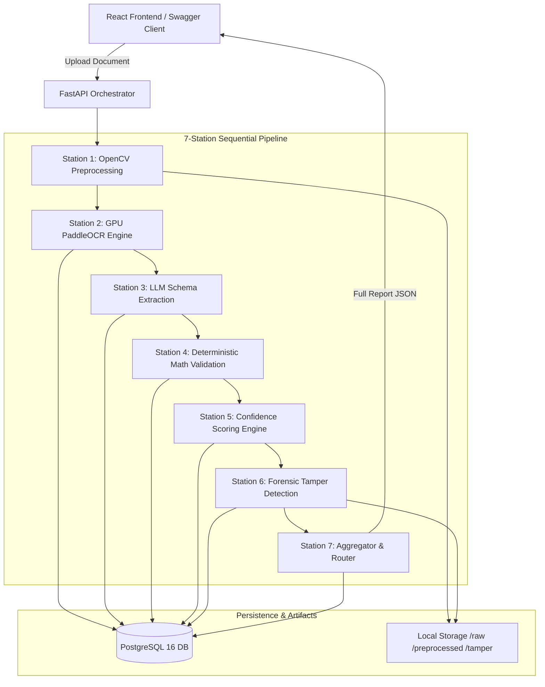
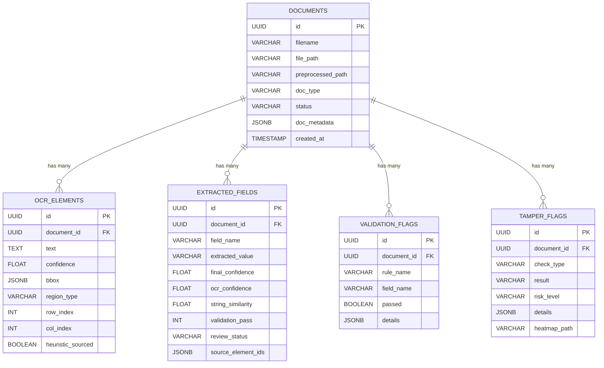

# 📄 How It Works: Technical Architecture & Step-by-Step Guide

This guide breaks down the **Document Intelligence & Forensic Tamper Detection Platform**. It provides both an intuitive mental model (the 7-station conveyor belt) and the **in-depth technical architecture, algorithms, subsystem drawings, and mathematical formulas** operating at every stage.

---

## 🏛️ Overall System Architecture

The platform follows a decoupled, API-first microservices architecture separating GPU vision processing, LLM-based structured reasoning, deterministic mathematical validation, and pixel-level forensic analytics.

### 1. ASCII Architecture Diagram
```
┌──────────────────────────────────────────────────────────────────────────────────┐
│                         CLIENT & PRESENTATION LAYER                              │
│   ┌────────────────────────────────────────┐  ┌──────────────────────────────┐   │
│   │   React 18 + Vite + TS Reviewer UI     │  │ Swagger UI / REST API Client │   │
│   │   (SVG Bounding Boxes + ELA Heatmaps)  │  │ (http://localhost:8000/docs) │   │
│   └───────────────────┬────────────────────┘  └──────────────┬───────────────┘   │
└───────────────────────┼──────────────────────────────────────┼───────────────────┘
                        │ HTTP POST Multipart / JSON           │
                        ▼                                      ▼
┌──────────────────────────────────────────────────────────────────────────────────┐
│                       GATEWAY & ORCHESTRATION LAYER                              │
│   ┌──────────────────────────────────────────────────────────────────────────┐   │
│   │                         FastAPI Web Server                               │   │
│   │   • CORS Middleware       • Static Storage Mount (/storage)              │   │
│   │   • Request Validation    • Pipeline Orchestrator (pipeline.py)          │   │
│   └─────────────────────────────────────┬────────────────────────────────────┘   │
└─────────────────────────────────────────┼────────────────────────────────────────┘
                                          │
    ┌─────────────────────────────────────┴─────────────────────────────────────┐
    │                                                                           │
    ▼                                                                           ▼
┌─────────────────────────────────────────┐ ┌─────────────────────────────────────────┐
│        DATA & PERSISTENCE LAYER         │ │      DEEP LEARNING & COMPUTE ENGINES    │
│                                         │ │                                         │
│ ┌─────────────────────────────────────┐ │ │ ┌─────────────────────────────────────┐ │
│ │          PostgreSQL 16 DB           │ │ │ │       Station 1: OpenCV Prep        │ │
│ │ • documents table (JSONB metadata)  │ │ │ │   • Deskew (minAreaRect + Affine)   │ │
│ │ • ocr_elements (bboxes, text, conf) │ │ │ │   • Bilateral Filter (Denoise)      │ │
│ │ • extracted_fields (citations, OSV) │ │ │ └──────────────────┬──────────────────┘ │
│ │ • validation_flags (rules, deltas)  │ │ │                    ▼                    │
│ │ • tamper_flags (ELA ratios, scores) │ │ │ ┌─────────────────────────────────────┐ │
│ └─────────────────────────────────────┘ │ │ │   Station 2: PaddleOCR on CUDA GPU  │ │
│                                         │ │ │   • PP-DocBlockLayout (Layout)      │ │
│ ┌─────────────────────────────────────┐ │ │ │   • PP-OCRv5 Server Det & Rec       │ │
│ │         Disk Storage Engine         │ │ │ │   • Spatial Grid Table Heuristic    │ │
│ │ • storage/raw/ (original uploads)   │ │ │ └──────────────────┬──────────────────┘ │
│ │ • storage/preprocessed/ (deskewed)  │ │ │                    ▼                    │
│ │ • storage/tamper/ (JET heatmaps)    │ │ │ ┌─────────────────────────────────────┐ │
│ └─────────────────────────────────────┘ │ │ │   Station 3: LLM Schema Extraction  │ │
│                                         │ │ │   • NVIDIA NIM (Nemotron-3-Ultra)   │ │
│                                         │ │ │   • Mandatory source_element_ids    │ │
│                                         │ │ └──────────────────┬──────────────────┘ │
│                                         │ │                    ▼                    │
│                                         │ │ ┌─────────────────────────────────────┐ │
│                                         │ │ │   Station 4: Python Math Audit      │ │
│                                         │ │ │   • subtotal + tax == total         │ │
│                                         │ │ └──────────────────┬──────────────────┘ │
│                                         │ │                    ▼                    │
│                                         │ │ ┌─────────────────────────────────────┐ │
│                                         │ │ │   Station 5: Multi-Factor Scoring   │ │
│                                         │ │ │   • 0.5*O + 0.3*S + 0.2*V           │ │
│                                         │ │ └──────────────────┬──────────────────┘ │
│                                         │ │                    ▼                    │
│                                         │ │ ┌─────────────────────────────────────┐ │
│                                         │ │ │   Station 6: Forensic Tamper Engine │ │
│                                         │ │ │   • PyMuPDF Metadata Forensics      │ │
│                                         │ │ │   • ELA JPEG Q=90 + 64x64 Grid Var  │ │
│                                         │ │ └─────────────────────────────────────┘ │
└─────────────────────────────────────────┘ └─────────────────────────────────────────┘
```

### 2. High-Level Mermaid Component Diagram


---

## 🔄 The 7 Inspection Stations: Deep Technological Breakdown

---

### 🧼 Station 1: The Clean-Up Station (Ingestion & Preprocessing)

#### 1. What It Does
* **Duplicate Fingerprinting:** Calculates an instantaneous binary checksum before running heavy models. If an identical file exists, it flags it immediately.
* **Format Normalization:** Automatically rasterizes multi-page vector PDFs into 300 DPI image matrices.
* **Deskewing:** Calculates orientation skew from scanned paper and rotates the image so text rows are horizontal.
* **Denoising:** Cleans scanner noise, speckles, and shadows while preserving character edges.

#### 2. Subsystem Architecture Drawing
```
Uploaded File (PDF/Image)
          │
          ├──► [hashlib.sha256] ──► Compare DB metadata ──► Duplicate Flagged
          │
          ├──► [PyMuPDF (fitz)] (If PDF) ──► 300 DPI Bitmap
          │
          └──► [OpenCV cv2]
                     │
                     ├── Grayscale ➔ cv2.threshold (THRESH_BINARY_INV + THRESH_OTSU)
                     ├── cv2.findNonZero (Text Pixel Coordinates)
                     ├── cv2.minAreaRect ➔ Compute Angle θ
                     ├── cv2.getRotationMatrix2D + cv2.warpAffine ➔ Deskew
                     └── cv2.bilateralFilter(d=9, sigmaColor=75, sigmaSpace=75)
                                    │
                                    ▼
                     Normalized Deskewed Image PNG
```

#### 3. ⚙️ How It Works (Technological Mechanisms)
* **Cryptographic Byte Hashing:** Uses Python `hashlib.sha256(file_bytes).hexdigest()`. Executed in streaming $\mathcal{O}(N)$ memory time. The hash is saved in `documents.doc_metadata->>'sha256'` and checked via index.
* **PDF Rasterization (`PyMuPDF / fitz`):**
  Uses a scaling matrix where factor $s = \frac{300}{72} \approx 4.1667$:
  $$\text{Matrix}(4.1667, 4.1667) \implies 300\text{ DPI Render}$$
* **Skew Angle Detection (`cv2.minAreaRect`):**
  Binarizes the image using Otsu thresholding, extracts all non-zero foreground points, and fits a minimum area oriented bounding box:
  $$\theta_{\text{deskew}} = \begin{cases} -(90 + \theta) & \text{if } \theta < -45^\circ \\ -\theta & \text{if } \theta \ge -45^\circ \end{cases}$$
* **Affine Rotation (`cv2.warpAffine`):**
  Generates an affine transformation matrix around the image center $(c_x, c_y)$ with interpolation `cv2.INTER_CUBIC` and white border fill `borderValue=(255, 255, 255)`.
* **Edge-Preserving Denoising (`cv2.bilateralFilter`):**
  Replaces pixel values using spatial Gaussian distance and photometric color intensity differences, preventing text blurring:
  $$I^{\text{filtered}}(p) = \frac{1}{W} \sum_{q \in \Omega} I(q) \exp\left(-\frac{\|p-q\|^2}{2\sigma_s^2}\right) \exp\left(-\frac{\|I(p)-I(q)\|^2}{2\sigma_c^2}\right)$$
  Parameters: `d=9, sigmaColor=75, sigmaSpace=75`.

---

### 👁️ Station 2: The Eye (GPU OCR & Table Detection)

#### 1. What It Does
* **Neural Text Localization:** Scans the preprocessed document and computes precise bounding boxes $[x, y, w, h]$ for all text lines.
* **Character Recognition:** Translates pixel patterns inside each box into Unicode text with individual probability scores.
* **Low-Confidence Gating:** Stamps unreadable, smudged, or low-probability text as `UNPROCESSABLE` so downstream AI never ingests garbage.
* **Spatial Table Reconstruction:** Clusters scattered cells into a 2D table matrix (rows and columns) when native table borders are absent.

#### 2. Subsystem Architecture Drawing
```
Preprocessed Image
        │
        ▼
[NVIDIA RTX 3050 GPU (CUDA 12.3)]
        │
        ├── PP-DocBlockLayout ────► Identifies Layout Regions (Paragraph, Table, Figure)
        ├── PP-LCNet Orientation ─► Rotates Inverted/Angled Lines Upright
        ├── PP-OCRv5 Server Det ──► Differentiable Binarization (DBNet) BBoxes [x, y, w, h]
        └── PP-OCRv5 Server Rec ──► SVTR Transformer + CTC Decode ➔ Text + Confidence c_i
                                                 │
                                                 ▼
                                     [Confidence Gate: c_i >= 0.30]
                                            /              \
                                          YES               NO
                                          /                  \
                                     Status: "OK"      Status: "UNPROCESSABLE"
                                          │                      │
                                          ▼                      ▼
                            [Spatial Grid Clustering]    (Shielded from LLM)
                            Clusters Y-bands ➔ Rows
                            Clusters X-bins  ➔ Cols
                                          │
                                          ▼
                            Persist to ocr_elements Table
                            (heuristic_sourced = true)
```

#### 3. ⚙️ How It Works (Technological Mechanisms)
* **GPU Deep Learning Pipeline:** Powered by `PaddleOCR / PPStructureV3` running directly on CUDA (`device="gpu:0"`). Inference takes **`0.80 seconds`** on an NVIDIA RTX 3050.
* **Text Detection (`PP-OCRv5_server_det`):** Built on the Differentiable Binarization (DBNet) architecture. Predicts probability maps and threshold maps to segment text contours at sub-pixel resolution.
* **Text Recognition (`PP-OCRv5_server_rec`):** Employs a Vision Transformer backbone (SVTR) combined with Connectionist Temporal Classification (CTC) greedy decoding to map character probabilities into strings.
* **Quality Threshold Gate:**
  $$\text{Gate}(c_i) = \begin{cases} \text{"OK"} & \text{if } c_i \ge 0.30 \\ \text{"UNPROCESSABLE"} & \text{if } c_i < 0.30 \end{cases}$$
* **Spatial Grid Heuristic (`infer_table_grid`):**
  When table line borders are missing (`table_res_list` empty):
  1. Elements are sorted vertically by $y$-coordinate.
  2. Elements within $\Delta y \le \frac{\text{median\_height}}{2}$ are merged into horizontal **Row Bands**.
  3. Inside each row band, elements are sorted by $x$-coordinate to assign **Column Indices**.
  4. Each cell is saved in `ocr_elements` with `row_index`, `col_index`, and `heuristic_sourced = True`.

---

### 🧠 Station 3: The Brain (LLM Schema Extraction & Citation Graph)

#### 1. What It Does
* **Semantic Document Classification:** Categorizes the document as an `invoice` or `salary_slip`.
* **Entity Extraction:** Maps raw text fragments into standardized business fields (Seller, Buyer, Invoice Number, Gross, Net Pay, etc.).
* **Zero-Hallucination Invariant:** Forces the LLM to cite the exact OCR box IDs where each number was read. If a field is not on the page, the LLM must return `null`.

#### 2. Subsystem Architecture Drawing
```
Valid OCR Elements (Status: OK)
  [ID: 12, Text: "HADI ENTERPRISES", BBox: [100, 50, 200, 30]]
  [ID: 15, Text: "INV-2024-001",    BBox: [350, 50, 120, 25]]
  [ID: 22, Text: "Total: 81500",     BBox: [400, 600, 150, 30]]
                 │
                 ▼
     [System Prompt Injection]
     • Schema: Pydantic InvoiceSchema / SalarySlipSchema
     • Constraint: Every non-null field MUST cite source_element_ids
     • Constraint: Missing fields MUST return null + []
                 │
                 ▼
    [NVIDIA NIM Cloud API]
    Model: nvidia/nemotron-3-ultra-550b-a55b
    (temperature=0.1, enable_thinking=False)
                 │
                 ▼
     [Structured JSON Response]
     {
       "seller": { "value": "HADI ENTERPRISES", "source_element_ids": [12] },
       "invoice_no": { "value": "INV-2024-001", "source_element_ids": [15] },
       "due_date": { "value": null, "source_element_ids": [] }
     }
```

#### 3. ⚙️ How It Works (Technological Mechanisms)
* **Model Inference:** Connects to NVIDIA NIM API (`https://integrate.api.nvidia.com/v1`) using the `nvidia/nemotron-3-ultra-550b-a55b` parameter reasoning model.
* **Deterministic Configuration:** Invoked with `temperature=0.1` and `chat_template_kwargs={"enable_thinking": False}` so reasoning tokens do not consume the context budget.
* **Locked Pydantic Contracts:**
  * Invoices use `InvoiceSchema` (`seller`, `buyer`, `invoice_no`, `invoice_date`, `due_date`, `subtotal`, `tax`, `total`, `line_items`).
  * Salary Slips use `SalarySlipSchema` (`employee_name`, `employer`, `pay_period`, `gross`, `deductions`, `net_pay`).
* **Citation Verification Law:**
  $$\forall \text{Field } f: \quad \text{Value}(f) \neq \text{null} \implies |\text{Citations}(f)| \ge 1 \quad \wedge \quad \text{Citations}(f) \subseteq \text{ValidOcrIDs}$$
  Any missing field is recorded in the `could_not_extract` array.

---

### 🧮 Station 4: The Accountant (Deterministic Math Validation)

#### 1. What It Does
* **Automated Audit:** Python code executes exact arithmetic checks on the extracted numbers.
* **Catches Mismatches:** Detects if OCR misread a digit (e.g., adding an extra zero turning $\$81,500$ into $\$815,000$).
* **Temporal Verification:** Confirms chronological order (e.g. Due Date $\ge$ Invoice Date).

#### 2. Subsystem Architecture Drawing
```
Extracted Entity Values
  • Subtotal = 81,500.00
  • Tax      = 1,500.00
  • Total    = 815,000.00
            │
            ▼
 [Deterministic Python Validator]
            │
            ├── Rule 1: Δ = |Subtotal + Tax - Total|
            │   Calculation: |81500 + 1500 - 815000| = 732,000
            │   Check: 732,000 <= 0.05 ──► FALSE (FAIL)
            │
            ├── Rule 2: |Gross - Deductions - NetPay| <= 0.05
            │
            └── Rule 3: parse_iso(due_date) >= parse_iso(invoice_date)
            │
            ▼
 Persist to validation_flags Table:
 {
   "rule_name": "subtotal_tax_sum",
   "passed": false,
   "details": { "difference": 732000, "expected": 83000, "total": 815000 }
 }
```

#### 3. ⚙️ How It Works (Technological Mechanisms)
* **Exact Floating-Point Comparison:**
  $$\Delta_{\text{inv}} = |\text{Subtotal} + \text{Tax} - \text{Total}|$$
  $$\text{ValidationPass} = \begin{cases} 1.0 & \text{if } \Delta_{\text{inv}} \le 0.05 \\ 0.0 & \text{if } \Delta_{\text{inv}} > 0.05 \end{cases}$$
* **Payroll Validation:**
  $$\Delta_{\text{payroll}} = |\text{Gross} - \text{Deductions} - \text{NetPay}| \le 0.05$$
* **Date Parsing & Comparison:** Normalizes dates into Python `datetime.date` objects via ISO 8601 formatting and confirms that:
  $$\text{Date}(\text{Due}) \ge \text{Date}(\text{Invoice})$$

---

### 📊 Station 5: The Trust Meter (Multi-Factor Confidence Scoring)

#### 1. What It Does
* **Objective Trust Score:** Calculates an objective confidence score from **0.0 to 1.0** for every field based on optics, text similarity, and math.
* **The Penalty Cap:** If mathematical validation failed at Station 4, the score is **instantly clamped to $\le 0.50$**, forcing human review.

#### 2. Subsystem Architecture Drawing
```
[Cited OCR Boxes]          [Extracted String vs OCR]         [Validation Flag]
       │                                │                           │
       ▼                                ▼                           ▼
Mean OCR Conf (O)             Levenshtein Sim (S)            Math Pass (V = 0 or 1)
   (Weight: 0.50)               (Weight: 0.30)                  (Weight: 0.20)
       │                                │                           │
       └────────────────────────┬───────┴───────────────────────────┘
                                │
                                ▼
        Linear Formula: Score = 0.50*O + 0.30*S + 0.20*V
                                │
                        Is Math Pass V == 0?
                               /    \
                             YES     NO
                             /        \
             Score = min(Score, 0.50)  Score unchanged
                             \        /
                              ▼      ▼
                      Final Field Confidence
                 (>= 0.70 ➔ auto_accepted | < 0.70 ➔ needs_review)
```

#### 3. ⚙️ How It Works (Technological Mechanisms)
* **The Formula:**
  $$\text{Confidence}(f) = 0.50 \cdot O(f) + 0.30 \cdot S(f) + 0.20 \cdot V(f)$$
* **Optical Component $O(f)$:** The arithmetic mean of all bounding boxes cited by the field:
  $$O(f) = \frac{1}{|C(f)|} \sum_{i \in C(f)} \text{conf}(e_i)$$
* **Lexical Similarity Component $S(f)$:** Normalized Levenshtein edit distance comparing extracted text against raw OCR text:
  $$S(f) = 1.0 - \frac{\text{LevenshteinDistance}(\text{value}, \text{ocr\_text})}{\max(\text{len}(\text{value}), \text{len}(\text{ocr\_text}))}$$
* **Validation Component $V(f)$:** $1.0$ if the field passed all arithmetic/date rules; $0.0$ if it failed.
* **The Clamping Invariant:**
  $$\text{If } V(f) = 0.0 \implies \text{Confidence}(f) = \min(\text{Confidence}(f), 0.50)$$

---

### 🕵️ Station 6: The Forensic Detective (Tamper Detection)

#### 1. What It Does
* **PDF Metadata Forensics:** Checks whether a PDF's creation timestamp precedes its modification timestamp or if editing tools (Photoshop, Acrobat Pro, Canva) were used.
* **Pixel Error Level Analysis (ELA):** Re-compresses the image at JPEG Quality 90 and measures compression error variance across $64 \times 64$ blocks. Edited or pasted text glows brightly on a color heatmap.

#### 2. Subsystem Architecture Drawing
```
Input Document
      │
      ├──► [Check A: PDF Metadata (PyMuPDF)]
      │         │
      │         ├── ModDate > CreationDate? ────► Flag: SUSPICIOUS
      │         ├── Producer in KnownEditingTools? ─► Flag: SUSPICIOUS
      │         └── Is Image (JPG/PNG)? ────────► Flag: NOT_APPLICABLE (No fake pass)
      │
      └──► [Check B: Error Level Analysis (ELA)]
                │
                ├── cv2.imencode('.jpg', Q=90) ➔ Re-compressed in memory
                ├── cv2.absdiff(Original, Recompressed) ➔ Delta Matrix Δ
                ├── cv2.convertScaleAbs(Δ, alpha=18.0) ➔ 18x Amplification
                ├── cv2.applyColorMap(COLORMAP_JET) ➔ Save PNG Heatmap
                │
                ▼
      [64x64 Block Variance Grid Scan]
                │
                ├── Compute Variance for each block: σ²_block
                ├── Calculate Global Mean Variance:  σ²_overall
                ├── Find Maximum Local Spike:       σ²_max
                ├── Variance Ratio: R = σ²_max / (σ²_overall + 1e-6)
                │
                ▼
      Decision Thresholds:
      • R >= 3.0 AND σ²_max > 150 ⟹ SUSPICIOUS (HIGH RISK)
      • R >= 2.0 AND σ²_max > 75  ⟹ SUSPICIOUS (MEDIUM RISK)
      • R < 2.0                   ⟹ CLEAN (LOW RISK)
```

#### 3. ⚙️ How It Works (Technological Mechanisms)
* **Metadata Forensics (`fitz` / PyMuPDF):** Reads the PDF dictionary. If the document was produced by editing software (`Photoshop`, `Acrobat Pro`, `GIMP`, `Canva`, `InDesign`), it flags `HIGH RISK`. For images without PDF headers, it returns `NOT_APPLICABLE`.
* **Error Level Analysis (ELA) Math:**
  1. Let $I$ be the image. Re-encode at 90% quality JPEG: $\tilde{I} = \text{JPEG}_{90}(I)$.
  2. Compute absolute pixel error: $D = |I - \tilde{I}|$.
  3. Amplify difference by $18\times$: $A = \min(18.0 \cdot D, 255)$.
  4. Generate a JET color map: Blue is lowest error (baseline), Red/White is highest error.
* **$64 \times 64$ Patch Statistical Scan:**
  The image is divided into disjoint $64 \times 64$ blocks $B_k$. For each block:
  $$\sigma^2_k = \text{Var}(B_k), \quad \bar{\sigma}^2 = \text{Mean}(\sigma^2_k), \quad \sigma^2_{\max} = \max_k(\sigma^2_k)$$
  $$\text{Variance Ratio } R = \frac{\sigma^2_{\max}}{\bar{\sigma}^2 + 10^{-6}}$$
  If $R \ge 3.0$ and $\sigma^2_{\max} > 150.0$, the document is marked **`SUSPICIOUS (HIGH RISK)`**.

---

### 🎯 Station 7: The Final Verdict (Aggregator & Routing)

#### 1. What It Does
Bundles all findings into a single response and routes the document:
* **`AUTO_ACCEPTED`:** High confidence ($\ge 0.70$) + passed math validation + low tamper risk.
* **`NEEDS_REVIEW`:** Low confidence ($< 0.70$) **OR** failed math validation **OR** suspicious tamper signals.

#### 2. Subsystem Architecture Drawing
```
Pipeline Results (DB Tables)
  • ocr_elements
  • extracted_fields
  • validation_flags
  • tamper_flags
            │
            ▼
 [Unified Report Aggregator]
 (pipeline.generate_full_report)
            │
            ├── Builds scalar fields dictionary with (O, S, V) confidence
            ├── Reconstructs line item rows
            ├── Embeds duplication status (SHA-256 + semantic match)
            ├── Attaches direct image URLs:
            │     • /storage/preprocessed/{id}_preprocessed.png
            │     • /storage/tamper/{id}_ela_heatmap.png
            │
            ▼
 Complete Unified JSON Response
 (GET /api/v1/documents/{doc_id}/full-report)
```

#### 3. ⚙️ How It Works (Technological Mechanisms)
* **Single Endpoint Aggregation:** `GET /api/v1/documents/{doc_id}/full-report` pulls from all relational tables via SQLAlchemy 2.0 in a single database session.
* **Direct Image Serving:** Mounted via Starlette `StaticFiles` at `/storage`, enabling the frontend reviewer UI to render the original image, bounding box overlays, and ELA heatmaps side-by-side.

---

## 💾 Database Entity-Relationship Model (PostgreSQL 16)


